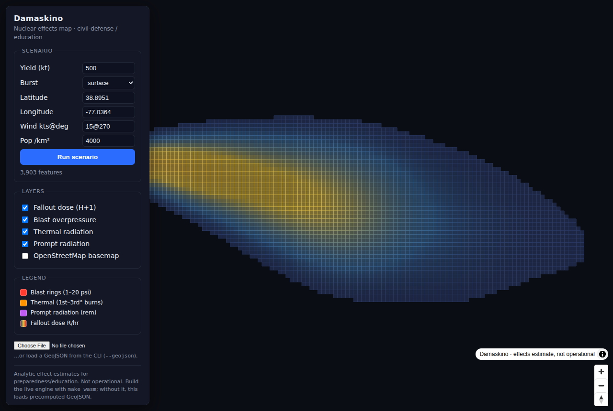

# Damaskino

A globally-applicable **nuclear-effects simulator** for civil-defense,
preparedness, and education. Given a weapon, a location, and (optionally) real
weather and terrain, it estimates **air blast, thermal radiation, initial
(prompt) nuclear radiation, radioactive fallout, and human casualties**, and
exports results as JSON and GeoJSON for mapping.

Damaskino models **consequences** from public science and public datasets
(Glasstone & Dolan, WSEG-10, Kingery-Bulmash, published lethality models,
HYSPLIT/FLEXPART-class Lagrangian dispersion). It contains **no weapon-design
information**. It is an educational / civil-defense tool in the spirit of NUKEMAP.

> ⚠️ Analytic effect estimates for preparedness/education — **not operational**.
> Spatial patterns and arrival times are more trustworthy than absolute dose
> numbers. See [`docs/PHYSICS_NOTES.md`](docs/PHYSICS_NOTES.md) for the honest
> model-fidelity ledger and [`plan.md`](plan.md) for the architecture.



---

## 1. Build & run

### Windows (native — no Visual Studio dev prompt needed)

Just run **`build.bat`** from any Command Prompt (or double-click it). It finds
your compiler automatically — MSVC (located via `vswhere`, set up for you),
otherwise `clang`, otherwise MinGW-w64 `gcc`:

```bat
build.bat            :: build build\damaskino.exe (full engine)
build.bat run        :: build, then run the Washington D.C. example
build.bat test       :: build and run all test suites
build.bat univac     :: build the UNIVAC-1219B lite profile
build.bat clean      :: delete the build folder
```

Then, for example:

```bat
build\damaskino.exe run examples\dc_500kt_surface.json --pop-density 4000 ^
      --json out.json --geojson out.geojson
```

If no compiler is found, install **Visual Studio 2022** with the
"Desktop development with C++" workload (or LLVM/clang, or MinGW-w64) and re-run
`build.bat`. You do **not** need to open a "Developer Command Prompt" — the
script sets up the toolchain itself.

### Linux / macOS (GNU make)

```sh
make            # build/damaskino          (full engine)
make univac     # build/damaskino_univac   (UNIVAC-1219B lite profile)
make test       # build and run the 6 test suites
make example    # generate web/example.geojson for the web map
make wasm        # (optional) compile the engine to WebAssembly (needs emscripten)
```

> The `Makefile` is GNU-make syntax — use `make` (Linux/macOS) or `mingw32-make`
> under MinGW. It is **not** `nmake`-compatible; on Windows use `build.bat`.

---

## 2. Command-line reference

```
damaskino run <scenario.json> [options]   run a scenario, print a report, export
damaskino ensemble <scenario.json> [opts] Monte Carlo -> probabilistic contours
damaskino validate [benchmarks.json]      check the models vs published data
damaskino dose --rate <R/hr> [opts]       personal fallout dose calculator
damaskino targets [--search T] [--state S] browse the target catalog
damaskino weapons                          list weapon presets
damaskino version
```

### `run` options

| Option | Meaning |
|---|---|
| `--json FILE` | comprehensive JSON report (effects, fallout, casualties, protective actions) |
| `--geojson FILE` | GeoJSON: effect-ring circles + fallout dose cells (for the map) |
| `--weather FILE` | real wind column (from `fetch_weather.py`) → **Lagrangian** fallout |
| `--dem FILE` | terrain DEM (ESRI ASCII grid) → line-of-sight masking + fallout |
| `--pop-density N` | uniform population (people/km²) → enables casualties |
| `--pop-asc FILE` | population raster (ESRI ASCII grid; WorldPop/GHS-POP) for real counts |
| `--pf N` | fallout sheltering protection factor (dose ÷ N) |
| `--pf-prompt N` | prompt-radiation protection factor (default 1) |
| `--thermal-exposed F` | fraction of people with line-of-sight to the fireball |
| `--exposure H` | fallout dose integration window in hours (default 48) |
| `--visibility KM` | atmospheric visibility for thermal (default 20) |
| `--time day\|night` | time-of-day population multiplier |
| `--threshold R/hr` | fallout cell threshold for the GeoJSON |
| `--quiet` | suppress the teletype report |

Without `--weather`, fallout uses the offline WSEG-10 transport; **with**
`--weather` it uses the modern Lagrangian particle-dispersion model (real winds,
wet-deposition rainout, anisotropic plume). Without `--pop-*`, casualties are
skipped.

### Examples

```sh
# Full report + map export, DC surface burst over dense population
damaskino run examples/dc_500kt_surface.json --pop-density 4000 \
    --json out.json --geojson out.geojson

# Modern Lagrangian fallout with real weather + terrain
damaskino run scenario.json --weather weather/dc.json --dem dem/dc.asc \
    --pop-asc pop/dc.asc --pf 10

# Probabilistic bands (Monte Carlo over yield/wind/fission uncertainty)
damaskino ensemble examples/dc_500kt_surface.json --samples 300 --weather weather/dc.json

# "When is it safe to leave the shelter?"
damaskino dose --rate 300 --arrival 1 --window 48 --pf 40

# Browse targets / weapons
damaskino targets --search "Norfolk"
damaskino weapons
```

---

## 3. Scenario JSON

```json
{
  "location": { "name": "Washington D.C.", "lat": 38.8951, "lon": -77.0364 },
  "weapon":   { "yield_kt": 500, "burst": "surface", "fission_fraction": 0.5 },
  "wind":     { "surface": { "speed_kts": 15, "direction_deg": 270 } },
  "grid":     { "n": 256, "cell_km": 1.0, "ref_time_hr": 1.0 }
}
```

All fields are optional (defaults applied). Instead of `location`/`weapon` you
may reference the **catalogs**:

```json
{ "target": "Raven Rock", "weapon_preset": "w87",
  "wind": { "surface": { "speed_kts": 20, "direction_deg": 240 } } }
```

- `target` — numeric id or a name substring (see `damaskino targets`)
- `catalog` — optional target file the `target` id/name resolves against
  (default `data/targets.json`; use `data/targets_adversary.json` for the
  USSR/China adversary list)
- `weapon_preset` — a weapon id (see `damaskino weapons`)
- `burst` — `"surface"` or `"air"` (air bursts get an optimal HOB if unset)
- `wind` — a single `surface` layer (winds aloft are estimated) or an explicit
  `layers` array (`altitude_ft`, `speed_kts`, `direction_deg`)

Invalid inputs (yield ≤ 0, ref_time ≤ 0, fission fraction outside [0,1],
out-of-range lat/lon) are rejected with a message.

---

## 4. Models & references

| Effect | Model | Reference |
|---|---|---|
| Air blast | cube-root-scaled peak overpressure + surface/HOB factor; Rankine-Hugoniot winds | Glasstone & Dolan; Kingery-Bulmash |
| Thermal | radiant fluence with forward-scatter transmittance; burn thresholds | Glasstone & Dolan |
| Prompt radiation | neutron+gamma, dual exponential attenuation, slant geometry | Glasstone; Fetter et al. 1990 |
| Fallout (real wind) | Lagrangian particle dispersion: size-resolved parcels, continuous settling, anisotropic spread + Pasquill-Gifford stability, wet-deposition rainout | HYSPLIT/FLEXPART-class; Freiling fractionation |
| Fallout (offline) | WSEG-10 transport + Gaussian deposition (fallback / UNIVAC) | WSEG Report #10 (1959) |
| Casualties | probit/LD50 for blast, thermal, radiation; sheltering; Way-Wigner dose | Glasstone; open lethality literature |
| Terrain | global DEM; line-of-sight masking (thermal/prompt) w/ Earth curvature | SRTM15+ / Copernicus |
| Cratering / EMP / activation | scaling laws; high-altitude E1 footprint; soil activation | Glasstone; Karzas-Latter |

WSEG-10 report (AD0261752): <https://apps.dtic.mil/sti/tr/pdf/AD0261752.pdf>.
`docs/PHYSICS_NOTES.md` records every calibration decision and remaining limit.

---

## 5. Data tools (`tools/`, Python — see `requirements.txt`)

These prepare the optional real-world datasets the engine consumes. Install deps
with `pip install -r requirements.txt`.

| Tool | Purpose |
|---|---|
| `tools/build_targets.py` | Clean the source aimpoint list(s) into `data/targets.json` (fixes typos, parses yields/burst, assigns ids). Run: `python tools/build_targets.py` |
| `tools/build_adversary_targets.py` | Build `data/targets_adversary.json` (USSR/China/DPRK) from the 1956 SAC "Air Power" airfield list (`prepatory_CSVs/usa_targets_1956.csv`), filtering out now-NATO/EU countries, categorizing, and modeling doctrine yields — plus ~34 curated modern ICBM/SSBN/bomber/C2 sites. Every row carries `source`/`category_source`/`yield_source` so real-vs-modeled is transparent. Run: `python tools/build_adversary_targets.py` |
| `tools/prepare_dem.py` | Clip a global DEM (SRTM15+/Copernicus) to a target tile the engine reads via `--dem`. `python tools/prepare_dem.py --raster world.tif --lat 38.9 --lon -77 --radius-km 60 --out dem/dc.asc` |
| `tools/fetch_weather.py` | Extract a wind column from ERA5 (Copernicus CDS) or GFS/GDAS (NOAA NCEP) GRIB2/NetCDF into the JSON the engine reads via `--weather`. `python tools/fetch_weather.py --grib gfs.grib2 --lat 38.9 --lon -77 --out weather/dc.json` |

`data/targets.json` (US target catalog), `data/targets_adversary.json`
(USSR/China/DPRK catalog), and `data/weapons.json` (weapon presets) ship
prebuilt; the engine loads them for `damaskino targets/weapons` and for scenario
`target`/`weapon_preset` references. Browse the adversary list with
`damaskino targets --catalog data/targets_adversary.json --state Russia`.

---

## 6. Web map (`web/`)

A self-contained MapLibre map of the engine's GeoJSON — fallout dose plume,
blast/thermal/prompt rings, ground zero — with layer toggles, popups, a legend,
and an optional OpenStreetMap basemap. MapLibre is vendored under `web/vendor/`,
so no internet is required to view it.

**Static (no build tools):** generate GeoJSON with the CLI and open the page.

```sh
make example                       # writes web/example.geojson (loaded by default)
python -m http.server -d web 8099  # then open http://localhost:8099
```

On Windows, after `build.bat`, produce a GeoJSON and drop it on the page's file
picker, or run the `http.server` line above (Python) — the page loads
`web/example.geojson` by default.

**Live in-browser engine (optional):** `make wasm` compiles the C core to
WebAssembly (`web/damaskino.js` + `.wasm`) so the scenario panel recomputes live.
This requires the **emscripten** SDK (`emcc`); without it the map still works
from precomputed GeoJSON.

---

## 7. Repository layout

```
build.bat            Windows build (no dev prompt needed)
Makefile             Linux/macOS build (GNU make)
include/             public engine API + physical units
src/engine/          physics, fallout (WSEG + Lagrangian), effects, casualties, ensemble
src/weather/         wind-column ingestion
src/io/              JSON, scenario, catalog, validation, output (JSON/GeoJSON/teletype)
src/json/            dependency-free JSON parser + writer
src/cli/             full-profile command-line driver
src/univac/          UNIVAC-1219B lite teletype driver
tests/               6 test suites (engine, effects, casualties, terrain, lagrangian, ensemble)
data/                US + USSR/China target catalogs + weapon presets (prebuilt JSON)
tools/               Python data-prep scripts (targets, adversary targets, DEM, weather)
web/                 MapLibre frontend (+ vendored MapLibre, example GeoJSON)
docs/                PHYSICS_NOTES.md (fidelity ledger) + images
prepatory_CSVs/      source aimpoint CSVs (build_targets.py, build_adversary_targets.py)
readme.txt           data-source URLs & attribution
examples/            sample scenarios
plan.md              architecture & roadmap (all phases delivered)
```

The **UNIVAC-1219B lite profile** (`build.bat univac` / `make univac`) is the
same engine core compiled with `-DUNIVAC`: `float` precision, a small grid, and
72-column teletype I/O, with no JSON/weather/DEM dependencies, so it
cross-compiles for vintage hardware.

---

## 8. Tests

`make test` (Linux/macOS) or `build.bat test` (Windows) builds and runs six
suites covering the JSON round-trip, the sub-models, effect benchmarks against
Glasstone/DS02, casualty probits, terrain line-of-sight, the Lagrangian
transport, and the Monte Carlo ensemble. `damaskino validate` checks the effect
models against published benchmarks (blast, thermal, prompt, crater, fallout).
